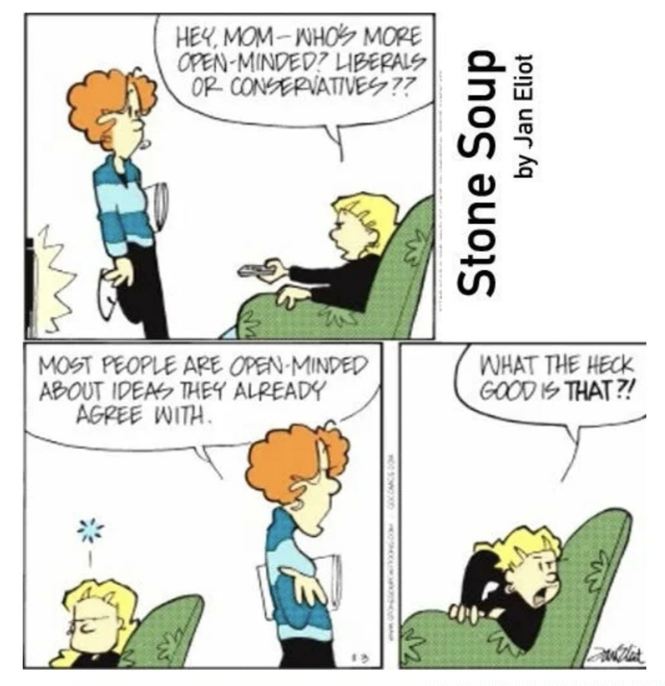

|10 to 12 years ago,
Typical Indian IT story - A new team is formed in India in a top 3 MNC in the country and people were hired in bulk. No one knew each other or the kind of work that we will do. Both freshmen and those with experience tasked to share project ownership while the other side of the world sleeps.

Each and everyone had their ideas on how to run team(s) and their projects and in a month and a half we were close to 30 of us. And people that you come across every walk of professional life - conflicts, gossips, likes and hates, people pleasers, ambitious and passtimers, and those who wanted to restart their career in a fresh place.

The geolocation is equally placed for both north and south of India and the best talent to choose from either side of the country. Given the diversity at the workplace, prejudices clouted hiring decisions on who should be hired based on which part of the country though this was never discussed in public. People took sides on what is right.

Competition for projects were high, since everyone were new, any project that came by was hunted upon only to be realized the so called numero uno _strategic_ project, is always the next one. Some chose to be happy with what they have, some chased bigger visibility project dropping the ball in hand, each had their own reasons.

There were knowledge sharing sessions with the teams in the other sides of the planet and there were restrictions on passing knowledge. Of course, why do you want to make someone successful when everyone is competing.

> Not everyone needs to know everything

Were there managers in this group? Yes. Were there architects? Yes, too. There were male, female, middle-aged, freshmen, mid-experienced, conservative, liberal, bald, beard, wise, gentle and arrogant. The perfect diversity mix that one can ask for. And people would gangup with like-minded, walk past the cubicles unable to face the other gangs. Unsaid norms were created, Beautiful friendships were formed and lifetime enemities were registered.

- Rational thoughts,
- free flow of communication,
- getting the points across and the other person being heard and understood,
- help each other succeed

  | These appeared to be a distant dream.

Make no mistake, these were talented people who has passed out of best colleges, worked in some best organizations prior, passed toughest interviews and take pride in the current organization.

|Looking back,

India was in its glorious peak in IT industry, engineering colleges just started mushrooming knowing the demand and Indian cities are gearing up with all the secondary jobs. So the future graduates, experienced job seekers, dependents & families and secondary job markets were dependent on these 30 folks to come together

> Indians cannot work with each other in India, we made a wrong choice to setup an office here

That's all it takes to collapse!

And here we are, who fought with each other, made life miserable for one other on things that didn't seem to worth anything in the long run.

---

Then came a leader. As a background, he was a Ex-program manager in a large IT organization, graduated from a non IIT and a six sigma black belt. It didn't matter to us anyway. We had our own battles to be won on a daily basis.

In one of the team meetings, he asked us a question the day I still remember

> What does customer want in what you're doing right now? Did you speak to the customer?

It didn't ring a bell. Can you ask again, please?

> Someone is paying your salary by paying for the product/feature? What does the customer want?

Managers and architects gave details that didn't register for us, the juniors and by watchers of this game. Then came the next question from the leader, let's name him Henry

> Can you support your suggestions and solution with data?
> Ok, let's talk when you have the data. I can deal with stakeholders if collecting data is going to take time. Let's fix a date now on when the data will be ready.

- Did we chase things ignoring the customer?

This question that popped up and went under the carpet immediately.

That year and the year that followed the MNC didn't pay any increase in salary due to recession so all the drama for personal wins were immaterial.

Over a period, those who added value to customers stayed on, moved up, paid well and were trusted by Henry and other leaders that followed. Bargains and haggles for projects were left to leaders at the top of the chain in a matrix organization who were a mix of both functional and technically competent ones. They voted for project leaders on what made sense for solving a customer's problem. The changes took time but it guaranteed for a long term success.

When joined in, Henry was disliked for 3 reasons -

- He was not a technical expert in a particular programming language.
- A term called as "Change agent" or Change catalyst was Greek and Spanish for most of us
- He was part of every meeting in initial days, there were senior members who treated this as a trust issue or intrusion into their boundaries

Days went by, Henry stood tall among others for 3 beliefs he had -

1. People are rational - The right intentions will be understood by people by giving more time.

|As a leader, he believed he had the right intentions. He selfdeclared those intentions in every opportunity and never tried to convince anyone. Instead he persuaded on _Why_ he believed something needs to be done in a certain way in a certain time.

2. Better organizational changes are not one person's job. It is not manager's / director's / lead's job. It is everyone's job

| It requires like minded people who initially step up for others to follow. Most times, managers overprotect their team to save face for good intentions. Once it is proved that the team is not impacted by the change most managers agree. So convincing team members two levels down is also a senior leader's job.

| His door was open for people at different career levels. As a junior, we could always walk up to him on why we think the organization is not doing something right. He was very particular in separating the people from the problem. He never allowed to pick person instead wanted us to talk about what the problem is.

3. He knew it was lonely at the top

| He needs to share a drink later in the day with the same folks he had a tough meeting in the morning. He was not doing a charity or service by exhausting himself, I admired he could establish trust, manage his time between both Headquarters and internal teams.

Not everyone liked him, but the numbers spoke for themselves. The number of projects delivered from his organization grew rapidly and he created jobs for 150+ people in 4 years.

---

12 years on:

> - Henry moved to Headquarters, then lead a 1200+ member organization with 80 managers/leaders at various levels reporting to him.
> - Functional customer oriented leaders were hired, groomed inhouse or joined in as part of inorganic growth. Product management became a department of its own putting customers first.
> - Technical experts put the business decisions first offering a technical solution.

I thank Henry who has shown me in-person, how to be a true leader.

So the original question

#### Why do you want to be a leader

- To step up, and showing the way
- To find order where there's chaos
- To challenge well-accepted thoughts and make decisions
- And to stay humble, there is always murphy's law
