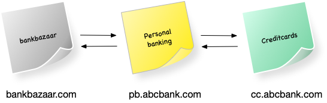

#### I cannot download from browser

> My curl request works, my api call from postman works but I cannot XHR from browser to download a file

CORS - Cross Origin Resource Sharing

Let's imagine API requests flowing between an aggregator aka, bankbazaar and 2 bank services of abcbank.com - Personal banking and credit cards

CORS helps in data sharing between different website domains say bankbazaar.com and pb.abcbank.com within the browser.

To set CORS,

- in server:
  - access-control-allow-origin header to be set with \*.bankbazaar.com at the abc bank server side and \*.abcbank.com to be set at the bankbazaar server side
- in browser client request:
  - Origin header to be passed

Not to be confused with Content Security Policy which helps importing js files from trusted content within the website say, bankbazaar.com

Additional notes:

- Preflight requests
  - If HTTP verb is anything other than GET/POST/PUT and if it has custom headers like application/xml or application/json browser initiates a pre-flight request - OPTIONS method automatically
  - Server responds with allowed origins for eg bankbazaar.com as a security measure before forwarding the original request
- OPTIONS and TRACE 405 - Method not allowed - Security loophole

References:

https://medium.com/@baphemot/understanding-cors-18ad6b478e2b

https://medium.com/@f2004392/cors-preflight-request-options-9d05b9248e5a

https://cheatsheetseries.owasp.org/cheatsheets/REST_Security_Cheat_Sheet.html
