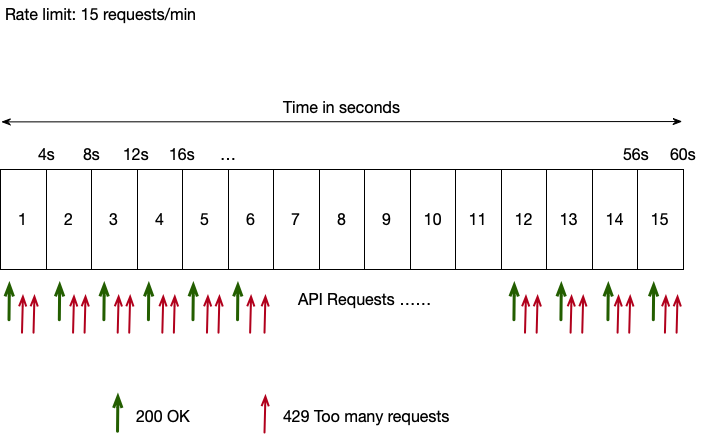

> Why count? scale up with data

> Why limit? Limited resources

Primary goal:

| Design systems that is _UP_ at all times

Prevent HTTP flooding & DDoS attacks

---

What is request rate?

Incoming api requests at the rate of 100 per minute, 100 per second.

When building one of our high performing enterprise applications, we came across a pattern of 429 - Too many requests.

We later realized the way nginx rate limiting works and adjusted our settings

So if we specify a rate-limit of 1200 requests per hour, nginx spans the limit equally into sliding windows and it makes no difference. For example 1200 req/hr = 20 req/min = 0.33 req/sec

This might look trivial but helps for better wording for API consumers that 1200 req/hr doesn't mean all 1200 requests can be placed at once.

---

References:

|                                                                                   |                                                                           |
| --------------------------------------------------------------------------------- | :-----------------------------------------------------------------------: |
| https://www.freecodecamp.org/news/nginx-rate-limiting-in-a-nutshell-128fe9e0126c/ |                      nginx rate limit - introduction                      |
| https://www.hostingadvice.com/how-to/nginx-vs-apache/                             | A comparison of nginx vs apache - Recommended: nginx for high performance |
| https://www.nginx.com/blog/mitigating-ddos-attacks-with-nginx-and-nginx-plus/     |                   Nginx documentation on rate limiting                    |
| https://www.eclipse.org/jetty/documentation/current/limit-load.html               |               Jetty max connections limit, acceptQueueSize                |
